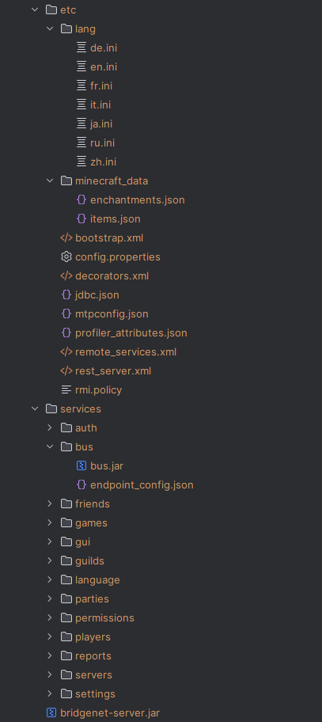

<div align="center">
  
  <br>
  
  
  
</div>

# Введение

BridgeNet — это мощная многопоточная протокольная система, разработанная для обеспечения надежного соединения и взаимодействия между внутренними серверами и игроками. Она включает в себя несколько API, которые позволяют выполнять динамическую коррекцию данных, манипулирование и маршрутизацию через заданные каналы и процессы.

# Обзор системы

## Что это такое?

BridgeNet предоставляет функциональность для создания и управления многопоточными соединениями между серверами и клиентами. Система спроектирована таким образом, чтобы обеспечить высокую производительность и масштабируемость, что делает её идеальным решением для крупных проектов, где требуется эффективное управление сетевыми взаимодействиями и обработка больших объемов данных в реальном времени.

## Основные функции

Многопоточность: Обеспечивает эффективное использование ресурсов процессора и улучшает производительность системы.
Модульность: Система разделена на модули, каждый из которых отвечает за выполнение определенных задач, что упрощает её поддержку и расширение.
API для разработчиков: Предоставляет множество API для реализации пользовательских команд, событий, задач и многого другого.
Модули и их API
Система BridgeNet состоит из нескольких модулей, каждый из которых выполняет определенные функции. Подробное описание каждого модуля и их API можно найти в документации по следующим ссылкам:

* [Bootstrap](/.docs/bootstrap.md)
* [Assembly](/.docs/assembly.md)
* [API Modules:](/.docs/api.md)
  * [API / Отложенные задачи (Delayed Runnables)](/.docs/api/autorun-api.md)
  * [API / Пользовательские команды (User Commands)](/.docs/api/commands-api.md)
  * [API / Подписка на события (Events Subscribing)](/.docs/api/events-api.md)
  * [API / Внедрение зависимостей (Dependency Injection)](/.docs/api/inject-api.md)
  * [API / Перехват методов (Method Intercepting)](/.docs/api/proxy-api.md)
  * [API / Планирование задач (Scheduling Tasks)](/.docs/api/scheduler-api.md)
* [Клиенты](/.docs/clients.md)
* [Тестовый движок](/.docs/test-engine.md)
* [Движок базы данных](/.docs/jdbc.md)
* [Профайлер](/.docs/profiler.md)
* [Основной протокол](/.docs/mtp.md)
* [REST API](/.docs/rest.md)
* [Сервисы и эндпоинты:](/.docs/services.md)
  * [СЕРВИС / Аутентификация (AUTH)](/.docs/services/auth-endpoint.md)
  * [СЕРВИС / Шина (BUS)](/.docs/services/bus-endpoint.md)
  * [СЕРВИС / Друзья (FRIENDS)](/.docs/services/friends-endpoint.md)
  * [СЕРВИС / Игровые сервера (GAMES)](/.docs/services/games-endpoint.md)
  * [СЕРВИС / Графический интерфейс (GUI)](/.docs/services/gui-endpoint.md)
  * [СЕРВИС / Гильдии (GUILDS)](/.docs/services/guilds-endpoint.md)
  * [СЕРВИС / Мультиязычность (LANGUAGE)](/.docs/services/language-endpoint.md)
  * [СЕРВИС / Mojang API (MOJANG)](/.docs/services/mojang-endpoint.md)
  * [СЕРВИС / Компании (PARTIES)](/.docs/services/parties-endpoint.md)
  * [СЕРВИС / Права доступа (PERMISSIONS)](/.docs/services/permissions-endpoint.md)
  * [СЕРВИС / Игроки (PLAYERS)](/.docs/services/players-endpoint.md)
  * [СЕРВИС / Жалобы (REPORTS)](/.docs/services/reports-endpoint.md)
  * [СЕРВИС / Сервера (SERVERS)](/.docs/services/servers-endpoint.md)
  * [СЕРВИС / Персонализация (SETTINGS)](/.docs/services/settings-endpoint.md)

# Руководство по использованию

Для работы с системой BridgeNet в корневой директории проекта находится скрипт под названием bridgenet, который необходимо запускать из терминала. Этот скрипт предоставляет список доступных команд и флагов, а также описание их процессов.

## Основные команды

```shell
$ ./bridgenet endpoints
```

Полная компиляция, конфигурация и последующая сборка всех сервисов и их эндпоинтов.

```shell
$ ./bridgenet assemblyEndpoints
```

Конфигурация скомпилированных сервисов в сборке.

```shell
$ ./bridgenet jar
```

Последовательная Maven компиляция основных модулей проекта BridgeNet.

```shell
$ ./bridgenet build
```

Полная и последовательная компиляция всех модулей проекта BridgeNet, включая сервисы.
Сборка системы
После выполнения указанных выше скриптов и команд в локальном проекте должна появиться папка .build, содержащая все необходимые файлы для работы системы. Пример содержимого данной папки представлен ниже:



Эта папка представляет собой полноценную и готовую к использованию сборку системы BridgeNet.

# Запуск и тестирование

## Локальный запуск

Для запуска системы локально используется единственный класс, содержащий статический метод main(String[] args): me.moonways.bridgenet.bootstrap.AppStarter.

## Тестирование

Для тестирования отдельных систем и подсистем в проекте реализован модуль testing, который разделен на несколько частей:

* **Test-Data**: Сборка модельных компонентов и констант, помогающих в тестировании.
* **Test-Engine**: Кастомный фреймворк на основе JUnit, автоматизирующий процессы тестирования в системе BridgeNet.
* **Test-Units**: Юнит-тесты для системы.

---

<div align="center">
    © MoonWays BridgeNet - 2024
    <br>
    Никакие права не защищены :(
</div>