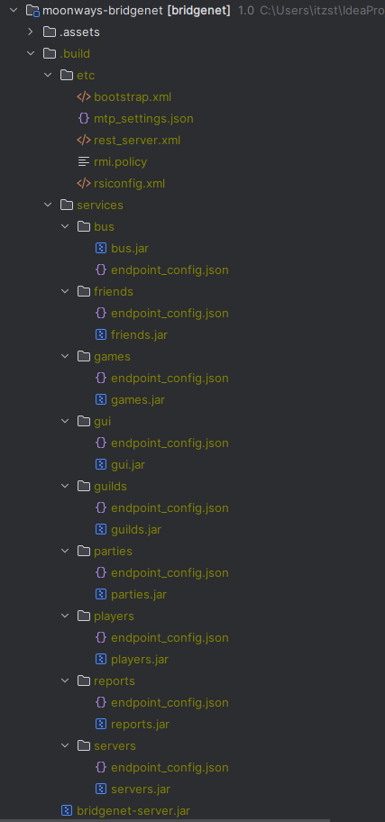

<div align="center">

<!--suppress CheckImageSize -->


# BRIDGENET

Protocol connections clouds & manipulations<br>
built on layer-services architecture.

</div>

---

## Что это такое?

Это протокольная система, обеспечивающая многопоточное<br>
соединение и связь между внутренними серверами и игроками<br>
играющими на них.<br>

Также в эту систему встроено несколько API,<br>
позволяющих осуществлять мобильную коррекцию, манипулирование и маршрутизацию<br>
данных по нужным каналам и процессам<br>

---

## Модули и их API

Система Bridgenet - модульная система. Каждый модуль отвечает за определенную задачу
<br>жизнедеятельности системы.
<br>В указанных ниже документациях можно разобрать каждый их них подробнее:

* [Bridgenet Bootstrap](.docs/bootstrap.md)
* [Bridgenet Assembly](.docs/assembly.md)
* [Application Programming Interface (API)](.docs/api.md):
    * [API / Automatically Runnable](.docs/api/autorun-api.md)
    * [API / Commands](.docs/api/commands-api.md)
    * [API / Events](.docs/api/events-api.md)
    * [API / Injector](.docs/api/inject-api.md)
    * [API / Instances Proxy](.docs/api/proxy-api.md)
    * [API / Schedulers](.docs/api/scheduler-api.md)
* [Bridgenet Connector](.docs/connector.md)
* [Database](.docs/jdbc.md)
* [Bridgenet Metrics Logger](.docs/metrics.md)
* [TCP MTP](.docs/mtp.md)
* [HTTP REST](.docs/rest.md)
* [Services and Endpoints](.docs/services.md)
    * [ENDPOINT / AUTH](.docs/services/auth-endpoint.md)
    * [ENDPOINT / BUS](.docs/services/bus-endpoint.md)
    * [ENDPOINT / FRIENDS](.docs/services/friends-endpoint.md)
    * [ENDPOINT / GAMES](.docs/services/games-endpoint.md)
    * [ENDPOINT / GUI](.docs/services/gui-endpoint.md)
    * [ENDPOINT / GUILDS](.docs/services/guilds-endpoint.md)
    * [ENDPOINT / PARTIES](.docs/services/parties-endpoint.md)
    * [ENDPOINT / PLAYERS](.docs/services/players-endpoint.md)
    * [ENDPOINT / REPORTS](.docs/services/reports-endpoint.md)
    * [ENDPOINT / SERVERS](.docs/services/servers-endpoint.md)
    * [ENDPOINT / SOCIALS](.docs/services/socials-endpoint.md)
* [Bridgenet Test-Engine](.docs/test-engine.md)

---

## Как пользоваться?

В корневой директории проекта находится скрипт под названием `bridgenet`,<br>
его необходимо запускать из терминала. Если мы введем данную команду, то<br>
получим список доступных команд и флагов, а также описание их процессов.<br>
<br>

Пройдемся по актуальным на момент написания документации:

---

```shell
$ ./bridgenet endpoints
```

- Данная команда выполняет полную компиляцию, конфигурацию и 
последующую сборку всех сервисов и их эндпоинтов.

---

```shell
$ ./bridgenet assemblyEndpoints
```

- Данная команда выполняет конфигурацию скомпилированных сервисов в сборке.

---
```shell
$ ./bridgenet jar
```

- Данная команда выполняет последовательную Maven компиляцию основных модулей проекта BridgeNet.

---

```shell
$ ./bridgenet build
```

- Данная команда выполняет полную (включая сервисы) и последовательную компиляцию всех модулей проекта BridgeNet.

---

## Сборка системы

После выполнения скриптов и команд, информация к которым предоставлена выше -<br>
в локальном проекте должна будет создасться папка `.build`<br>
<br>
На актуальный момент написания документации полное содержимое выглядит следующим образом:



Так выглядит полноценная и готовая сборка системы BridgeNet.

---

## Запуск и тестирование

Локальный запуск системы происходит из единственного класса во всем проекте,<br>
который содержит статический `main(String[] args)` метод:<br>
`me.moonways.bridgenet.bootstrap.AppStarter`

Для тестирования отдельных систем и подсистем был реализован 
модуль `test-engine`

Его основной код содержит базовую реализацию интеграции Bridgenet-сервера 
в запуск юнит-тестов, а каждый юнит-тест отдельно запускает 
локальную сборку Bridgenet-сервера.

---

