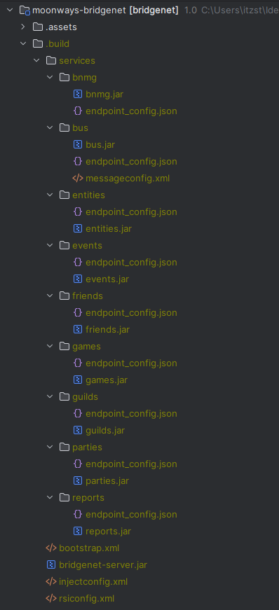

<div align="center">


# MOONWAYS BRIDGE NET

Protocol connections clouds & manipulations<br>
built on layer-services architecture.

</div>

---

## Что это такое?

Это протокольная система, обеспечивающая многопоточное
соединение и связь между внутренними серверами и игроками
играющими на них.

Также в эту систему встроено несколько API,
позволяющих осуществлять мобильную коррекцию, манипулирование и маршрутизацию данных по нужным каналам и процессам.
нужные каналы и процессы.

---

## Как пользоваться?

В корневой директории проекта находится скрипт под названием `bridgenet`,<br>
его необходимо запускать из терминала. Если мы введем данную команду, то<br>
получим список доступных команд и флагов, а также описание их процессов.<br>
<br>

Пройдемся по актуальным на момент написания документации:

---

```shell
$ ./bridgenet -ep
```
_или можно иначе:_
```shell
$ ./bridgenet --endpoints
```

- Данная команда выполняет полную компиляцию, конфигурацию и 
    последующую сборку всех сервисов и их эндпоинтов.

---

```shell
$ ./bridgenet -epc
```
_или можно иначе:_
```shell
$ ./bridgenet --endpointsconfig
```

- Данная команда выполняет конфигурацию скомпилированных сервисов в сборке.

---

```shell
$ ./bridgenet -b
```
_или можно иначе:_
```shell
$ ./bridgenet --build
```

- Данная команда выполняет последовательную Maven компиляцию основных модулей проекта BridgeNet.

---

```shell
$ ./bridgenet -fb
```
_или можно иначе:_
```shell
$ ./bridgenet --fullbuild
```

- Данная команда выполняет полную (включая сервисы) и последовательную компиляцию всех модулей проекта BridgeNet.

---

## Сборка системы

После выполнения скриптов и команд, информация к которым предоставлена выше -<br>
в локальном проекте должна будет создасться папка `.build`<br>
<br>
На актуальный момент написания документации полное содержимое выглядит следующим образом:



Так выглядит полноценная и готовая сборка системы BridgeNet.

---

## Запуск и тестирование

Локальный запуск системы происходит из единственного класса во всем проекте,<br>
который содержит статический `main(String[] args)` метод:<br>
`me.moonways.bridgenet.bootstrap.AppStarter`

Для запуска локальных тестов в некоторых модулях написаны<br>
простейшие тесты в необходимой для этого директории.

---